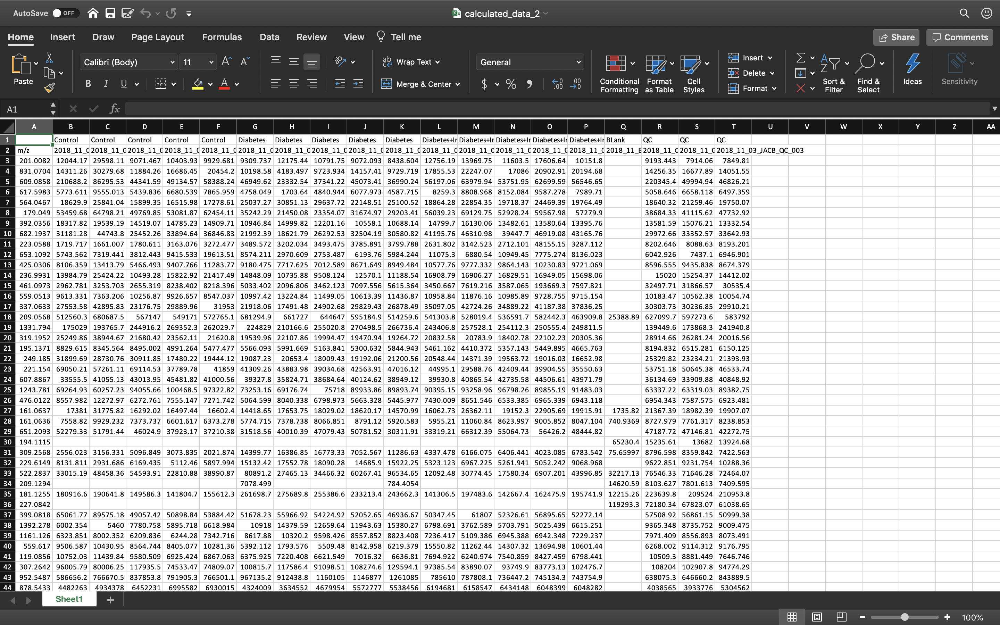

# Automating_Excel
 Automate Excel using Python and Tkinkter to help scientists be more convenient when calculating data

This project is to help phD Researchers get more convenient when calculating large amount of molecules data
# A. Generate xlsx file to calculate Metabolomic data
## Step 1: Using xlrd library to access to the excel file: 
- "readData" function is to process the calculation with the formula of ``` result = data of each cell - blank data ```
```
  def readData(str):
    # Load excel file to calculate
    wb = xlrd.open_workbook(str)
    ws = wb.sheet_by_index(0)
```
-  These lines open the original excel file that the researchers have sent to the developers.

- ```ws = wb.sheet_by_index(0)``` opens the first worksheet in the file
- Next, we have these lines of code: 
```rows = ws.nrows
    cols = ws.ncols
    table = []
    count = 0

    # calculate data - Blank
    for y in range(cols):
        record = []
        count += 1
        for x in range(rows):
            if 0 < y < 16:
                if isinstance(ws.cell(x, y).value, float) and isinstance(ws.cell(x, 16).value, float):
                    record.append(ws.cell(x, y).value - ws.cell(x, 16).value)
                else:
                    record.append(ws.cell(x, y).value)
            else:
                record.append(ws.cell(x, y).value)
        new_record = record
        table.append(new_record)

    # replace 0 with empty cell
    replace_empty(table)

    # separating calculations to another xlsx file
    new_file_calculated(table, count)

    return table
 ```
   - The lines below are to get number of rows and columns of the table:
   ```
      rows = ws.nrows
      cols = ws.ncols
   ``` 
   - We use nested for loop to go through each cells to calculate and update the cells in the worksheet.
   ```
    table = []
    count = 0
    
    # calculate data - Blank
    for y in range(cols):
        record = []
        count += 1
        for x in range(rows):
            if 0 < y < 16:
                if isinstance(ws.cell(x, y).value, float) and isinstance(ws.cell(x, 16).value, float):
                    record.append(ws.cell(x, y).value - ws.cell(x, 16).value)
                else:
                    record.append(ws.cell(x, y).value)
            else:
                record.append(ws.cell(x, y).value)
        new_record = record
        table.append(new_record)
  ```
  - Specifically:
  ```
  if isinstance(ws.cell(x, y).value, float) and isinstance(ws.cell(x, 16).value, float):
                    record.append(ws.cell(x, y).value - ws.cell(x, 16).value)
  else:
                    record.append(ws.cell(x, y).value)
  ```
  - The if statement is to check if the cell value is of type ```float``` or not.
    - If the condition satisfies, we append the difference between group data and blank data to ```record``` list
    - If not, we simply append the value available in the cell.
  - Instead of directly append the ```record``` list to ```table```, we store in another variable ```new_record```, then we append the list to the ```table```.
  - Then, we need to automate the replacement of the cell in which the value is 0.01 or 0:
  ```
  replace_empty(table)
  ```
  - Explicitly, we work on this function by using nested loop:
  ```
  def replace_empty(lists):
    table_len = len(lists)
    element_len = len(lists[0])
    for y in range(table_len):
        for x in range(element_len):
            if lists[y][x] == 0:
                lists[y][x] = None
  ```
 - The last step in ```readData(str)``` function is to generate a new "xlsx" file with new data using ```new_file_generated``` function:
 ```
 def new_file_calculated(lists, cols):
    workbook = xlsxwriter.Workbook('calculated_data_2.xlsx')
    worksheet = workbook.add_worksheet()

    for x in range(cols):
        worksheet.write_column(0, x, lists[x])
    workbook.close()
```
- We use ```xlsxwriter``` library to create a new Excel Workbook
  - ```worksheet = workbook.add_worksheet()``` is to create a new worksheet in the new xlsx file.
  - Then we implement a for loop and ```write_column``` method to write the 2-d list as columns
  - ```workbook.close()``` to save and close the newly created workbook.
 
 ## Step 2: Use tkinter library to create a GUI that generates xlsx file:
 - We have the code below:
 ```
 def tkinter_window():

    window = Tk()
    # frame = Frame(window)
    window.title("Calculating Metabolomic Data")

    window.geometry('500x200')

    tab_control = ttk.Notebook(window)
    tab1 = ttk.Frame(tab_control)
    tab_control.add(tab1, text="Calculate Step 1")
    tab_control.pack(expand=YES, fill="both")

    tab2 = ttk.Frame(tab_control)
    tab_control.add(tab2, text="Separate Group")

    tab3 = ttk.Frame(tab_control)
    tab_control.add(tab3, text="Check Percentage")

    # tab 1
    lbl = Label(tab1, text="Excel File Name")
    lbl.pack(padx=2, pady=2)

    txt = Entry(tab1, width=40)
    txt.pack(padx=2, pady=2)

    # generate a new xlsx file
    def clicked():
        res = "File has been entered."
        readData(txt.get())
        messagebox.showinfo('Success!', res)

    btn = Button(tab1, text="Generate", command=clicked)
    btn.pack(padx=5, pady=5)

    # tab 2
    lbl_2 = Label(tab2, text="Group Name")
    lbl_2.pack(padx=2, pady=2)

    txt_2 = Entry(tab2, width=40)
    txt_2.pack(padx=2, pady=2)

    def separate():
        res = "Group name has been entered"
        failed_msg = 'There is no such group. Please try again'
        text = txt_2.get()
        # if text != 'Control' or text != 'Diabetes' or text != 'Diabetes+Insulin':
        #     messagebox.showinfo('Failed!', failed_msg)
        if text == "Control" or text == "Diabetes" or text == "Diabetes+Insulin":
            produce_count_data(text)
            messagebox.showinfo('Success!', res)

    btn_2 = Button(tab2, text="Generate", command=separate)
    btn_2.pack(padx=5, pady=5)

    # tab 3 - check percentage
    lbl_3 = Label(tab3, text="Group Name")
    lbl_3.pack(padx=2, pady=2)

    txt_3 = Entry(tab3, width=40)
    txt_3.pack(padx=2,pady=2)

    def check():
        text = txt_3.get()
        res = "Perfect! The file is being processed."
        failed = "Either the group does not exist or the file have not been created. Please try again."
        if text == "Control":
            check_percentage("Control_Group.xlsx")
            messagebox.showinfo('Success!', res)
        elif text == "Diabetes":
            check_percentage("Diabetes_Group.xlsx")
            messagebox.showinfo('Success!', res)
        elif text == "Diabetes+Insulin":
            check_percentage("Diabetes_Insulin_Group.xlsx")
            messagebox.showinfo('Success!', res)
        else:
            messagebox.showinfo('Failed!', failed)

    btn_3 = Button(tab3, text="Generate", command=check)
    btn_3.pack(padx=5, pady=5)

    window.mainloop()
 ```
 
 - In this project, we will use ```ttk.Notebook(window)``` to build tabs for the GUI: 
   - To talk about step 2 of the project, to begin with, we will mention ```tab1``` first. This tab is to execute the ```readData``` function above. These lines demonstrate the work:
   
   ```
    tab1 = ttk.Frame(tab_control)
    tab_control.add(tab1, text="Calculate Step 1")
    tab_control.pack(expand=YES, fill="both")
    lbl = Label(tab1, text="Excel File Name")
    lbl.pack(padx=2, pady=2)

    txt = Entry(tab1, width=40)
    txt.pack(padx=2, pady=2)

    # generate a new xlsx file
    def clicked():
        res = "File has been entered."
        readData(txt.get())
        messagebox.showinfo('Success!', res)

    btn = Button(tab1, text="Generate", command=clicked)
    btn.pack(padx=5, pady=5)
   
   ```
   - The code above will create a GUI like the image below: 
   
   <p align="center">
    
   </p>
   
   - Now, ```clicked()``` function specifies the event after you click on button ```Generate```. In this project's step 1, as you can see, it will generate a new data in ```calculated_data_2.xlsx``` file:
   
   <p align="center">
    
   </p>
   
# B. Separate each group in a new Excel file
 - Now we are done with generating new data, we might as well want to separate just to be more comfortable when working with each group.
 ## Step 1: Implement a ```separate_group()``` function
 - The lines below help us separate between groups, and adding the data associated with ```group_name``` in the new list:
 ```
 # separate group
def separating_group(table, string):
    count = 0
    tab = []
    original_table = read_data("Raw_data_and_steps_Diabetes_data.xlsx")[0]
    slicing = slice(1, len(original_table))
    tab.append(original_table[slicing])

    for y in range(len(table)):
        record = []
        if table[y][0] == string:
            abbreviation(record, string)
            for x in range(len(table[1])):
                if isinstance(table[y][x], float) or table[y][x] is None:
                    record.append(table[y][x])
            new_record = record
            tab.append(new_record)

    count_table = ["Count"]
    for x in range(1, len(tab[0])): # not counting first row - title row
        count = 0
        for y in range(1, len(tab)): # not counting first column - m/z column
            if tab[y][x] is not None:
                count += 1
        count_table.append(count)

    # appending the count table to count the appearance of data each row
    tab.append(count_table)

    return tab
 ```
   - To begin with, it would be nice if we can include m/z column in every single group data file. Here, I used ```slice()``` function to get the m/z column so the researchers can be more convenient when analyzing the data.
   - We use nested loop to loop through each element in the 2-d list. Explicitly, in the line ```if table[y][0] == string:```, we want to check if the group name matches the input or not. If so, we can check the data if they are either of type ```float``` or ```None```, then we can append to ```record``` list. After that, we store ```record``` list in another variable ```new_record``` and then append it to a new table ```tab``` to create a new table. This implementation is the same as the step in ```readData(str)``` function (looping step)
   - Also, to make life easier for the last step of the project, we append ```count_table``` list to the ```tab``` table above. ```count_table``` list counts the appearance of data in each row. 
   ## Step 2: Create a new tab to generate group data with count
   - These lines of code below illustrate what we are doing:
   ```
    tab2 = ttk.Frame(tab_control)
    tab_control.add(tab2, text="Separate Group")
    
    lbl_2 = Label(tab2, text="Group Name")
    lbl_2.pack(padx=2, pady=2)

    txt_2 = Entry(tab2, width=40)
    txt_2.pack(padx=2, pady=2)

    def separate():
        res = "Group name has been entered"
        failed_msg = 'There is no such group. Please try again'
        text = txt_2.get()
        if text == "Control" or text == "Diabetes" or text == "Diabetes+Insulin":
            produce_count_data(text)
            messagebox.showinfo('Success!', res)

    btn_2 = Button(tab2, text="Generate", command=separate)
    btn_2.pack(padx=5, pady=5)
   ```
   - The same implementation happens in this second tab. We have ```Label```, ```Entry``` for filling in the group name, and the ```Generate``` button. However, the difference is the ```separate``` function:
   ```
   def separate():
        res = "Group name has been entered"
        failed_msg = 'There is no such group. Please try again'
        text = txt_2.get()
        if text == "Control" or text == "Diabetes" or text == "Diabetes+Insulin":
            produce_count_data(text)
            messagebox.showinfo('Success!', res)
   ```
   - The ```if``` statement check if the input matches the groups we have in the original data. In this case, they are ```Control```, ```Diabetes```, and ```Diabetes+Insulin```. The image below shows the result:
    <p align="center">
    
   </p>
   
   - And below is the example of ```Control``` table after being processed:
    <p align="center">
    
   </p>
   
   - Now we are done with Step 2, let's move on to the last step of the project!
 # C. Check the percentage of the appearance of data and update file
 ## Step 1: Implementing ```check_percentage()``` function to certify the percentage existence of the data in a particular row:
 - Particularly, if the data in one row exists more than 65% of the whole row. For instance, if there is only 1 empty cell in a row out of 5 column, then we do not have to do anything. However, if the empty cells are more than 1, so the appearance of the data will be 3 out of 5, which is 60% < 65%. Then, the whole row will be reset. In other words, the cells will be changed to empty and the ```count``` column will be reset to 0. Here is the code:
 ```
 # check if over 65%, if yes -> keep. If not, empty cells in row
 def check_percentage(string):
    wb = openpyxl.load_workbook(filename=string)
    sheet = wb['Sheet1']
    row = sheet.max_row
    column = sheet.max_column
    for x in range(1, row + 1):
        if sheet.cell(row=x, column=6).value/5.0 < 0.65:
            sheet.cell(row=x, column=6).value = 0
            for y in range(1, column):
                sheet.cell(row=x, column=y).value = None

    wb.save(string)
 ```
 - In this function, we used ```openpyxl``` library to open the Excel Workbook (```openpyxl.load_workbook(filename=string)```). 
 - Moving on to the for loop, we want to use ```if``` statement to check if the appearance of data in a row exceeds 65% or not.
 - Finally, we save the updated workbook using ```wb.save(string)```.
 - The function will be implemented in ```tkinter``` window, which is the next step!!!
 ## Step 2: Add the ```Check Percentage``` tab to the tkinter window:
 ```
 # tab 3 - check percentage
    lbl_3 = Label(tab3, text="Group Name")
    lbl_3.pack(padx=2, pady=2)

    txt_3 = Entry(tab3, width=40)
    txt_3.pack(padx=2,pady=2)

    def check():
        text = txt_3.get()
        res = "Perfect! The file is being processed."
        failed = "Either the group does not exist or the file have not been created. Please try again."
        if text == "Control":
            check_percentage("Control_Group.xlsx")
            messagebox.showinfo('Success!', res)
        elif text == "Diabetes":
            check_percentage("Diabetes_Group.xlsx")
            messagebox.showinfo('Success!', res)
        elif text == "Diabetes+Insulin":
            check_percentage("Diabetes_Insulin_Group.xlsx")
            messagebox.showinfo('Success!', res)
        else:
            messagebox.showinfo('Failed!', failed)

    btn_3 = Button(tab3, text="Generate", command=check)
    btn_3.pack(padx=5, pady=5)
 ```
 - Skipping to the ```check()``` function to process the ```btn_3```, as we can see, we are using ```if elif else``` statement to check the legitimacy of the group name. If exists, we can update the file associated to the group name. For instance, if we type ```Control``` in the ```Entry```, the program will generate, i.e update the existing xlsx file ```Control_Group.xlsx``` to empty rows using ```check_percentage()``` function.
 - Following these lines of code, similarly to first and second tab above, we have something like this:
 <p align="center">
    
   </p>
   
 - After clicking the ```Generate``` button, this event will happen:
 <p align="center">
    
   </p>
   
 - As you can see in line 78 of the ```Control_Group.xlsx``` file, the line originally exists 1 data, hence ```count = 1```. After step 3, the data is set to empty, and ```count``` column is reset to 0. 
 
 # D. Saving data to ```csv``` file
 - In this step, we do not need many functions to perform the generation of data. We only have to implement:
   - ```read_group_data_with_average()``` function
   - ```save_csv()``` function, and
   - Add a new tab to the desktop application to generate ```final_data.csv```
  ## Step 1: Read each group data, including average of each row data.
   ```
   # Read group data with average: 1. Control 2. Diabetes 3. Diabetes+Insulin
    def read_group_data_with_average(str):
     wb = xlrd.open_workbook(str)
     ws = wb.sheet_by_index(0)
     rows = ws.nrows
     cols = ws.ncols
     table = []
     count = 0
     average_column = calculate_average(str)

     for y in range(cols):
         record = []
         if y < cols - 1:
             for x in range(rows):
                 record.append(ws.cell(x,y).value)
             new_record = record
             table.append(new_record)

     # calculate average of group data in each row using openpyxl
     table.append(average_column)

     return table
   ```
   - As I said, we are going to read all of the data in ```Control_Group.xlsx```, ```Diabetes_Group.xlsx```, and ```Diabetes+Insulin_Group.xlsx``` files.
   - ```average_column = calculate_average(str)``` is to get the ```Avg``` column from the function ```calculate_average(str)``` with ```str``` parameter being the name of the xlsx file:
   ```
   # average of group data : Control_Group.xlsx, Diabetes_Group.xlsx, Diabetes_Insulin_Group.xlsx
   def calculate_average(string):
       wb = openpyxl.load_workbook(filename=string)
       sheet = wb['Sheet1']
       row = sheet.max_row
       column = sheet.max_column
       col = []
       col.append("AVG")
       for x in range(2, row + 1):
           average = 0.0
           for y in range(2, column):
               if sheet.cell(row=x, column=y).value is not None:
                   average = average + sheet.cell(row=x, column=y).value
           average = average / 5.0
           col.append(average)

       change_to_1(col)
       wb.save(string)

       return col

   ```
   - In this function, I used ```openpyxl``` library to load and read the file. Next, I calculate the average of each row data which is the sum of all data in a row and divided by the number of data in that row, which is 5.
   - Going back to ```read_group_data_with_average(str)``` function, I continue to append each column of the group data into ```table``` list. Finally, I append ```average_column``` to ```table``` so that we have a group data with average.
   ## Step 2: Create a function ```save_csv()``` to save to a csv file after adding all group data (with average) into a large table list.
    ```
       # save to csv file
       def save_csv(table):
          export_data = zip_longest(*table, fillvalue='')
          with open('final_data.csv', 'w', newline='') as file:
              writer = csv.writer(file, quoting=csv.QUOTE_ALL)
              writer.writerows(export_data)
          file.close()
    ```
    - In this function, we just export the data into ```final_data.csv``` file after looping data using ```itertools``` library. For more information, you can read https://docs.python.org/3.0/library/itertools.html to learn more about itertools.
   ## Step 3: Create a new tab in the desktop application to generate ```final_data.csv```.
   - In ```tkinter_window()``` function, we continue to add another tab using this code:
   ```
    tab4 = ttk.Frame(tab_control)
    tab_control.add(tab4, text="Final Data")
    # tab 4 - save to csv
    lbl_4 = Label(tab4, text="Generate Final Data")
    lbl_4.pack(padx=2, pady=2)

    def final():
        start = timeit.default_timer()
        res = "Perfect! The file is being processed."
        final_table = []
        # produce data after checking percentage in tables
        control_table = read_group_data_with_average("Control_Group.xlsx")
        diabetes_table = read_group_data_with_average("Diabetes_Group.xlsx")
        diabetes_insulin_table = read_group_data_with_average("Diabetes_Insulin_Group.xlsx")

        # append to a big table
        for x in range(len(control_table)):
            final_table.append(control_table[x])
        for x in range(1, len(diabetes_table)):
            final_table.append(diabetes_table[x])
        for x in range(1, len(diabetes_insulin_table)):
            final_table.append(diabetes_insulin_table[x])

        save_csv(final_table)
        messagebox.showinfo('Success!', res)
        stop = timeit.default_timer()
        print('Time: ', stop - start)

    btn_4 = Button(tab4, text="Generate", command=final)
    btn_4.pack(padx=5, pady=5)

   ```
   - Particularly, the ```final()``` function is to add all data into a large table ```final_table```; also, we use this table as a parameter for ```save_csv(final_table)``` function so that we can generate a csv file as we want.
   - Then, we add Label and Button as usual.
   <p align="center">
    
   </p>
   
   - We are done with Step 4 - Generating csv file. (P/s: You can check the result in my repository - file ```final_data.csv```).
   # E. p-value / log_2 FC generator
   ## Step 1: Algorithm for p-value:
   - First and formost, we have to find a legitimate algorithm to calculate p-value. If you have taken a statistics class in college, this should not be a burden. The algorithm is below:
 ```
   # test p value calculation
   def test_p(data_1, data_2):
       mean1 = np.mean(data_1)
       mean2 = np.mean(data_2)
       # get std error
       se1 = sem(data_1)
       se2 = sem(data_2)
       # standard error on the difference between the samples
       sed = np.sqrt(se1 ** 2.0 + se2 ** 2.0)
       if sed == 0:
           return None
       # calculate T Statistic
       t_stat = (mean1 - mean2) / sed
       # degrees of freedom
       df = len(data_1) + len(data_2) - 2
       # calculate the p-value
       p = (1.0 - t.cdf(abs(t_stat), df))
       return p
```
  - First of all, we calculate mean of two lists of data using ```numpy``` library. 
  - Then, we calculate the standard error of two lists using ```scipy``` library and ```sem(data)``` function.
  - After that, as I said in the comment of the code, we ```calculate the standard error on the difference between the samples```. 
     - ```if``` statement is to check if the cell is empty.
  - We can follow the algorithm as I mentioned above about T Statistic, degree of freedom, and finally, p-value.
  ## Step 2: Read data from files that have been generated in step 2 (Control_Group, Diabetes_Group, and Diabetes+Insulin_Group).
  - We create a function to read the data from each group without ```Count``` and ```Average``` column:
```
  # Read group data only
  def read_group_data(str):
      wb = xlrd.open_workbook(str)
      ws = wb.sheet_by_index(0)
      rows = ws.nrows
      cols = ws.ncols
      table = []
      count = 0

      for y in range(cols):
          record = []
          if y < cols - 1:
              for x in range(rows):
                  record.append(ws.cell(x, y).value)
              new_record = record
              table.append(new_record)

      return table
  ```
   ## Step 3: Transposing columns to rows using ```get_row()``` function:
   - We also using a simple nested loop to do this. The only difference is we exchange the range of row to column and column to row:
   ```
    def get_row(table):
    tab = []
    for x in range(len(table[0])):
        rec = []
        for y in range(len(table)):
            rec.append(table[y][x])
        new_rec = rec
        tab.append(new_rec)

    return tab
   ```
   ## Step 4: (Optional) Change every empty cell to value 0:
   - We have this code:
   ```
   # change back empty cells to 0
   def change_to_zero(table):
       for x in range(len(table)):
           for y in range(len(table[0])):
               if table[x][y] == "":
                   table[x][y] = 0
   ```
   - Here, we check each element in 2d list (each element in an excel file) if it is empty. If yes, change to 0.
   ## Step 5: Get p value column:
   - Based on the steps above, we can generate the code like below: 
   ```
   # p value to compare 2 groups
   def get_p_value(str1, str2):
       # read data from specific groups
       table_1 = read_group_data(str1)
       slicing1 = slice(1, len(table_1))
       table_1 = table_1[slicing1]

       table_2 = read_group_data(str2)
       slicing2 = slice(1, len(read_group_data(str2)))
       table_2 = table_2[slicing2]

       # change None to 0 cell
       change_to_zero(table_1)
       change_to_zero(table_2)

       # p value calculation
       p_col = []

       # get each row
       data_1 = get_row(table_1)
       data_2 = get_row(table_2)

       # print(test_p(data_1[0], data_2[0]))
       for x in range(1, len(data_1)):
           p = test_p(data_1[x], data_2[x])
           p_col.append(p)

       return p_col
   ```
 - As you can see, we have included all functions created above to generate p value column.
 - To begin with, since in each group data, we have m/z column, but our objective is only dependent on the group data, so we are going to cut m/z column off the list by using ```slice()``` function again.
 - Then, we change ```None``` elements, which represent empty cells, to 0.
 - Third, we can transpose the data using ```get_row()``` function to be more convenient when calculating the p value of each row.
 - Last but not least, we calculate p-value in each row using ```test_p()``` function, then appending each p value into ```p_col``` list.
 - We can return the list ```p_col``` now.
   ## Step 6: Calculate log_2 value:
   - We create a one-line function just to return the result of the difference between 2 log_2 data using ```numpy```:
   ```
   # test get log2
   def get_log(a1, a2):
       return np.log2(a1) - np.log2(a2)
   ```
   - Next, we append each of the log_2 data of each row in a list using ```calculate_log()``` function:
   ```
   def calculate_log(str1, str2):
    avg_1 = calculate_average(str1)
    avg_2 = calculate_average(str2)

    log_col = []

    for x in range(1, len(avg_1)):
        log = get_log(avg_1[x], avg_2[x])
        log_col.append(log)

    return log_col
   ```
   - For this function, the two data we need to calculate the log are 2 average data of 2 group to compare. (For instance: Average of Control group and Average of Diabetes group), so we need average columns of both groups.
   - Next, we create a simple for loop to calculate log_2 in each row and append the result to the ```log_col``` list.
   - Return the ```log_col``` list.
   
## Step 7: Combine p-value / log_2 columns to 2 group data:
- Before looking at the code, there are some considerations to be mentioned:
  - With this step, we want the columns to be combined: m/z, columns of 2 groups, average columns of 2 groups, p-value, and/or   log_2 column.
  - Plus, if average is none, we can change to 1 for the sake of the original file.
  - There will be 2 types representing the file that is generated:
   - Type 0: p-value only
   - Type 1: p-value and log_2 FC
- Okay, let's look at the code:
```
# combine p value with 2 group data
def produce_combine_p(str1, str2, type):
    # initialize table to combine data
    group_1 = ""
    group_2 = ""
    if str1 == "Control_Group.xlsx":
        group_1 = "C"
    elif str2 == "Control_Group.xlsx":
        group_2 = "C"
    if str1 == "Diabetes_Group.xlsx":
        group_1 = "DM1"
    elif str2 == "Diabetes_Group.xlsx":
        group_2 = "DM1"
    if str1 == "Diabetes_Insulin_Group.xlsx":
        group_1 = "DM1+I"
    elif str2 == "Diabetes_Insulin_Group.xlsx":
        group_2 = "DM1+I"

    table = []

    table.append(get_mz_col())
    # read data from specific groups
    table_1 = read_group_data(str1)
    table_2 = read_group_data(str2)

    # append each column into the table
    # str1 data
    for x in range(1, len(table_1)):
        # insert name of group at the first row
        # table_1[x].insert(0, group_1)
        table.append(table_1[x])

    # str1 average data
    avg_1 = calculate_average(str1)
    change_to_1(avg_1)
    # avg_1.insert(0, "AVG")
    table.append(avg_1)

    # str2 data
    for x in range(1, len(table_2)):
        # table_2[x].insert(0, group_2)
        table.append(table_2[x])

    # str2 average data
    avg_2 = calculate_average(str2)
    change_to_1(avg_2)
    # avg_2.insert(0, "AVG")
    table.append(avg_2)

    # change None to 0 cell
    change_to_zero(table_1)
    change_to_zero(table_2)

    # append p_value column
    p_col = get_p_value(str1, str2)
    p_col.insert(0, "p_value")
    table.append(p_col)

    # New workbook xlsx file
    # p value only
    if type == 0:
        produce_file_p_log(table, str1, str2, type)

    # both p value and log
    elif type == 1:
        log_col = calculate_log(str1, str2)
        str_log = "LOG2FC " + group_1 + "/" + group_2
        log_col.insert(0, str_log)
        table.append(log_col)
        produce_file_p_log(table, str1, str2, type)
```
- The first few lines with a bunch of conditional statements are only to label each column group data with symbols (For example: Control data will be labeled as "C").
- Next, you can follow each step of appending data into the table: m/z column -> first group data -> average of first group data -> second group data -> average of second group data -> p-value (```if type == 0```) / p-value and log_2 (```if type == 1```)
- Now, in the ```if else``` statements to generate p value and/or log_2 columns, we create another function ```produce_file_p_log()``` to handle this:
```
# produce data in new file with p value or p value and log
def produce_file_p_log(table, str1, str2, type):
    if type == 0:
        if str1 == "Control_Group.xlsx" and str2 == "Diabetes_Group.xlsx":
            workbook = xlsxwriter.Workbook('C_DM1_p_value.xlsx')
            worksheet = workbook.add_worksheet()
            for x in range(len(table)):
                worksheet.write_column(0, x, table[x])
            workbook.close()
        elif str1 == "Control_Group.xlsx" and str2 == "Diabetes_Insulin_Group.xlsx":
            workbook = xlsxwriter.Workbook('C_DM1+I_p_value.xlsx')
            worksheet = workbook.add_worksheet()
            for x in range(len(table)):
                worksheet.write_column(0, x, table[x])
            workbook.close()
        elif str1 == "Diabetes_Group.xlsx" and str2 == "Diabetes_Insulin_Group.xlsx":
            workbook = xlsxwriter.Workbook('D_DM1+I_p_value.xlsx')
            worksheet = workbook.add_worksheet()
            for x in range(len(table)):
                worksheet.write_column(0, x, table[x])
            workbook.close()
    elif type == 1:
        if str1 == "Control_Group.xlsx" and str2 == "Diabetes_Group.xlsx":
            workbook = xlsxwriter.Workbook('C_DM1_p_value_log2.xlsx')
            worksheet = workbook.add_worksheet()
            for x in range(len(table)):
                worksheet.write_column(0, x, table[x])
            workbook.close()
        elif str1 == "Control_Group.xlsx" and str2 == "Diabetes_Insulin_Group.xlsx":
            workbook = xlsxwriter.Workbook('C_DM1+I_p_value_log2.xlsx')
            worksheet = workbook.add_worksheet()
            for x in range(len(table)):
                worksheet.write_column(0, x, table[x])
            workbook.close()
        elif str1 == "Diabetes_Group.xlsx" and str2 == "Diabetes_Insulin_Group.xlsx":
            workbook = xlsxwriter.Workbook('D_DM1+I_p_value_log2.xlsx')
            worksheet = workbook.add_worksheet()
            for x in range(len(table)):
                worksheet.write_column(0, x, table[x])
            workbook.close()
```
- I made this intuitive by reading on the name of the xlsx file. For example, if the type is 0, we check for the name of  group data based on the str1, str2 parameters. Then we can add the table that is implemented in ```produce_combine_p()``` function to generate xlsx file using ```xlsxwriter``` library.

  ## Step 8: Create a new tab to generate p value/ log_2 FC data file
  - Just as before, we add another tab in the ```tkinter_window``` function:
  ```
  tab5 = ttk.Frame(tab_control)
  tab_control.add(tab5, text="Get p value")
  
   # tab 5 - get p value
    lbl_5 = Label(tab5, text="Get p value - C: Control, D: Diabetes; DI: Diabetes+Insulin")
    lbl_5.pack(padx=2, pady=2)

    txt_5 = Entry(tab5, width=20)
    txt_5.pack(padx=2, pady=2)

    txt_5_2 = Entry(tab5, width=20)
    txt_5_2.pack(padx=2, pady=2)

    v = IntVar()
    radio_1 = Radiobutton(tab5, text="p value only", variable=v, value=0)
    radio_1.pack(anchor=W)
    radio_2 = Radiobutton(tab5, text="p and log2", variable=v, value=1)
    radio_2.pack(anchor=W)

    # generate file based on entry
    def pval():
        res = "File has been generated"
        failed = "Please enter the correct group"
        if v.get() == 0:
            if (txt_5.get() == "C" and txt_5_2.get() == "D") or (txt_5.get() == "D" and txt_5_2.get() == "C"):
                produce_combine_p("Control_Group.xlsx", "Diabetes_Group.xlsx", 0)
                messagebox.showinfo('Success!', res)
            elif (txt_5.get() == "C" and txt_5_2.get() == "DI") or (txt_5.get() == "DI" and txt_5_2.get() == "C"):
                produce_combine_p("Control_Group.xlsx", "Diabetes_Insulin_Group.xlsx", 0)
                messagebox.showinfo('Success!', res)
            elif (txt_5.get() == "D" and txt_5_2.get() == "DI") or (txt_5.get() == "DI" and txt_5_2.get() == "D"):
                produce_combine_p("Diabetes_Group.xlsx", "Diabetes_Insulin_Group.xlsx", 0)
                messagebox.showinfo('Success!', res)
            else:
                messagebox.showerror("Error", failed)
        if v.get() == 1:
            if (txt_5.get() == "C" and txt_5_2.get() == "D") or (txt_5.get() == "D" and txt_5_2.get() == "C"):
                produce_combine_p("Control_Group.xlsx", "Diabetes_Group.xlsx", 1)
                messagebox.showinfo('Success!', res)
            elif (txt_5.get() == "C" and txt_5_2.get() == "DI") or (txt_5.get() == "DI" and txt_5_2.get() == "C"):
                produce_combine_p("Control_Group.xlsx", "Diabetes_Insulin_Group.xlsx", 1)
                messagebox.showinfo('Success!', res)
            elif (txt_5.get() == "D" and txt_5_2.get() == "DI") or (txt_5.get() == "DI" and txt_5_2.get() == "D"):
                produce_combine_p("Diabetes_Group.xlsx", "Diabetes_Insulin_Group.xlsx", 1)
                messagebox.showinfo('Success!', res)
            else:
                messagebox.showerror("Error", failed)

    btn_5 = Button(tab5, text="Generate", command=pval)
    btn_5.pack(padx=5, pady=5)
  ```
  - The Label and Button creation are the same, but the only difference is the ```RadioButton``` function. We want to have a choice between generating p_value only and both p_value/log_2 FC, so I created radio buttons so that the researchers are more comfortable when trying to generate a particular file they want. 
  - We can dive a little bit deeper at these lines: 
  ```
    v = IntVar()
    radio_1 = Radiobutton(tab5, text="p value only", variable=v, value=0)
    radio_1.pack(anchor=W)
    radio_2 = Radiobutton(tab5, text="p and log2", variable=v, value=1)
    radio_2.pack(anchor=W)

  ```
    - So each radio buttons will depend upon the value of variable v. Here, ```radio_1``` represents ```v.get() = 0```, and ```radio_2``` represents ```v.get() = 1```.
    - As you can see, ```v.get()``` variable is created to check the type of file we want to generate. 
     - If ```v.get() = 0```, we only want to generate a file with p-value 
     - Else if ```v.get() = 1```, we want to generate both a file with p-value and log_2
     - Below is the image of the tab I created:
     <p align="center">
    
   </p>
   
   - You can take a look at the files generated in my repository.
   - We are done with this step!!!
     
# F: Up/Down-Regulated File Generator:
  - The purpose of this step is to generate file data based on p-value, log_2 FC, and the following conditions:
    - Upregulated: Log2 FC > 0.5849 and p < 0.05 
    - Downregulated: Log2 FC < -0.5849 and p < 0.05
  ## Step 1: Create a function to read all data in any xlsx file.
  - As mentioned above, we can use the following lines of code to read the data, and this should be intuitive. I used ```xlrd``` library to read the data and transfer to the list using nested loop.
  ```
  def read_all_data(file):
    wb = xlrd.open_workbook(file)
    ws = wb.sheet_by_index(0)
    rows = ws.nrows
    cols = ws.ncols
    table = []
    for y in range(cols):
        record = []
        for x in range(rows):
            record.append(ws.cell(x, y).value)
        new_record = record
        table.append(new_record)

    return table
  ```
  ## Step 2: A function to handle the up/down-regulated conditions:
  - With this, we need to find an algorithm to properly read through the data in a list, and then apply the conditions. The following code luckily satisfies our need:
  ```
     def up_down_regulated(file, up_or_down):
       table = read_all_data(file)
       change_to_zero(table)

       # keep track of index
       i = 1
       # if up-regulated
       if up_or_down == 0:
           # loop to put data to the correct list
           # for y in range(len(table[0]) - 1):

           while i < len(table[0]):
               if table[len(table) - 2][i] == 0 and table[len(table) - 1][i] == 0:
                   for x in table:
                       del x[i]
               elif table[len(table) - 2][i] >= 0.05 or table[len(table) - 1][i] <= 0.5849:
                   for x in table:
                       del x[i]
               else:
                   i += 1

       # if down-regulated
       elif up_or_down == 1:
           # loop to put data to the correct list
           while i < len(table[0]):
               if table[len(table) - 2][i] == 0 and table[len(table) - 1][i] == 0:
                   for x in table:
                       del x[i]
               elif table[len(table) - 2][i] >= 0.05 or table[len(table) - 1][i] >= -0.5849:
                   for x in table:
                       del x[i]
               else:
                   i += 1
       return table
  ```
  - First, I immediately used the ```read_all_data()``` function created above to generate data in ```table``` list. Again, we can use ```change_to_0``` function to change any ```None``` element to 0 for the sake of calculation.
  - Next, we can see that the conditions are set for ```up_or_down``` variable, because it represents the type of file we want to generate:
    - If ```up_or_down == 0```, we generate Up-regulated files.
    - Else if ```up_or_down == 1```, we generate Down-regulated files.
  - Then, we loop and check the conditions for each data. If any row is not satisfied with the condition that is set above for up/down-regulated data, we remove that row.
  - Return the table after having been modified.
  ## Step 2: Add a tab in the desktop application
  - Again, we use the following code to add another tab into the app:
  ```
    tab6 = ttk.Frame(tab_control)
    tab_control.add(tab6, text="Up/Down-regulated")
    
    lbl_6 = Label(tab6, text="Group Name: Control, Diabetes, Diabetes+Insulin")
    lbl_6.pack(padx=2, pady=2)

    b = IntVar()
    radio_cd = Radiobutton(tab6, text="Control - Diabetes", variable=b, value=0)
    radio_cd.pack(anchor=W)
    radio_cdi = Radiobutton(tab6, text="Control - Diabetes+Insulin", variable=b, value=1)
    radio_cdi.pack(anchor=W)
    radio_ddi = Radiobutton(tab6, text="Diabetes - Diabetes+Insulin", variable=b, value=2)
    radio_ddi.pack(anchor=W)

    a = IntVar()
    radio_up = Radiobutton(tab6, text="Up-regulated", variable=a, value=0)
    radio_up.pack(anchor=W)
    radio_down = Radiobutton(tab6, text="Down-regulated", variable=a, value=1)
    radio_down.pack(anchor=W)

    # generate up-regulated / down-regulated file based on radio choice
    def up_down():
        table = []
        res = "Yes! You have successfully generated the file"
        failed = "Please try again"
        if a.get() == 0:
            if b.get() == 0:
                table = up_down_regulated("C_DM1_p_value_log2.xlsx", 0)
                workbook = xlsxwriter.Workbook('Up (C x DM1).xlsx')
                worksheet = workbook.add_worksheet()
                for x in range(len(table)):
                    worksheet.write_column(0, x, table[x])
                workbook.close()
                messagebox.showinfo("Success!", res)
            elif b.get() == 1:
                table = up_down_regulated("C_DM1+I_p_value_log2.xlsx", 0)
                workbook = xlsxwriter.Workbook('Up (C x DM1+I).xlsx')
                worksheet = workbook.add_worksheet()
                for x in range(len(table)):
                    worksheet.write_column(0, x, table[x])
                workbook.close()
                messagebox.showinfo("Success!", res)
            elif b.get() == 2:
                table = up_down_regulated("D_DM1+I_p_value_log2.xlsx", 0)
                workbook = xlsxwriter.Workbook('Up (D x DM1+I).xlsx')
                worksheet = workbook.add_worksheet()
                for x in range(len(table)):
                    worksheet.write_column(0, x, table[x])
                workbook.close()
                messagebox.showinfo("Success!", res)
            else:
                messagebox.showerror("Failed!", failed)
        elif a.get() == 1:
            if b.get() == 0:
                table = up_down_regulated("C_DM1_p_value_log2.xlsx", 1)
                workbook = xlsxwriter.Workbook('Down (C x DM1).xlsx')
                worksheet = workbook.add_worksheet()
                for x in range(len(table)):
                    worksheet.write_column(0, x, table[x])
                workbook.close()
                messagebox.showinfo("Success!", res)
            elif b.get() == 1:
                table = up_down_regulated("C_DM1+I_p_value_log2.xlsx", 1)
                workbook = xlsxwriter.Workbook('Down (C x DM1+I).xlsx')
                worksheet = workbook.add_worksheet()
                for x in range(len(table)):
                    worksheet.write_column(0, x, table[x])
                workbook.close()
                messagebox.showinfo("Success!", res)
            elif b.get() == 2:
                table = up_down_regulated("D_DM1+I_p_value_log2.xlsx", 1)
                workbook = xlsxwriter.Workbook('Down (D x DM1+I).xlsx')
                worksheet = workbook.add_worksheet()
                for x in range(len(table)):
                    worksheet.write_column(0, x, table[x])
                workbook.close()
                messagebox.showinfo("Success!", res)
            else:
                messagebox.showerror("Failed!", failed)
        else:
            messagebox.showerror("Failed!", failed)

    btn_6 = Button(tab6, text="Generate", command=up_down)
    btn_6.pack(padx=5, pady=5)
  ```
  - We can see the reappearance of ```RadioButton``` function. Also, we do not need a field to fill in, since we have already done them in ```up_down_regulated()``` and ```up_down()``` function above.
  - This time, we have 2 separated RadioButton groups associated with different variables ```a``` and ```b```:
    - ```b```: represents 2 group data to be compared
    - ```a```: represents types of files to be generated: 
      - ```a.get() == 0```: Up-regulated
      - ```a.get() == 1```: Down-regulated
  - Again, I used ```xlsxwriter``` library to generate xlsx file based on the radio button selected and the conditions in ```up_down()``` function.
  - Finally, we are done with this step. The result of the tab is below. The files generated is in my repository. 
  <p align="center">
    
   </p>
    
      
   
